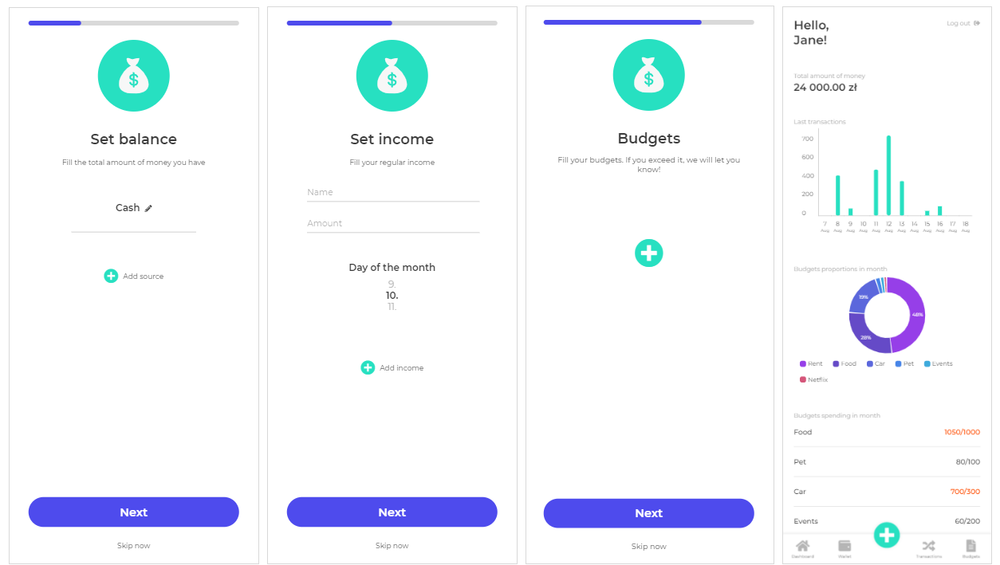
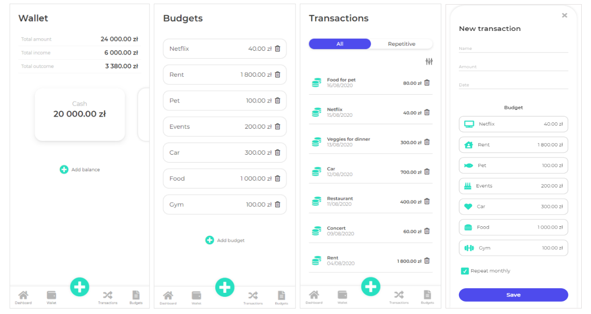

# Money Flow - Budget Tracker

## Table of contents
* [General info](#general-info)
* [Technologies](#technologies)
* [Setup](#setup)
* [Status](#status)
* [Contact](#contact)

## General info
Firebase hosting:  https://money-flow-budget-tracker.firebaseapp.com/

This application is based only on custom components. 
You can fill your balance, add your budgets and transactions.
After completing the data, you'll see the statistics.

## Technologies
* HTML5
* SCSS
* Angular 9
* Typescript
* TSLint
* Firebase
* PWA
* moment.js

## Setup
To run this project, install it locally using npm:

* Clone this repository
$ git clone https://github.com/ewelina-slepko/budget-tracker

* Go into the repository
$ cd budget-tracker

* Install dependencies
$ npm install

* Run the app
$ npm start

## Status
Project is: _in progress_.

## Contact
Created by Ewelina Ślepko (slepko.ewelina@gmail.com) - feel free to contact me!
